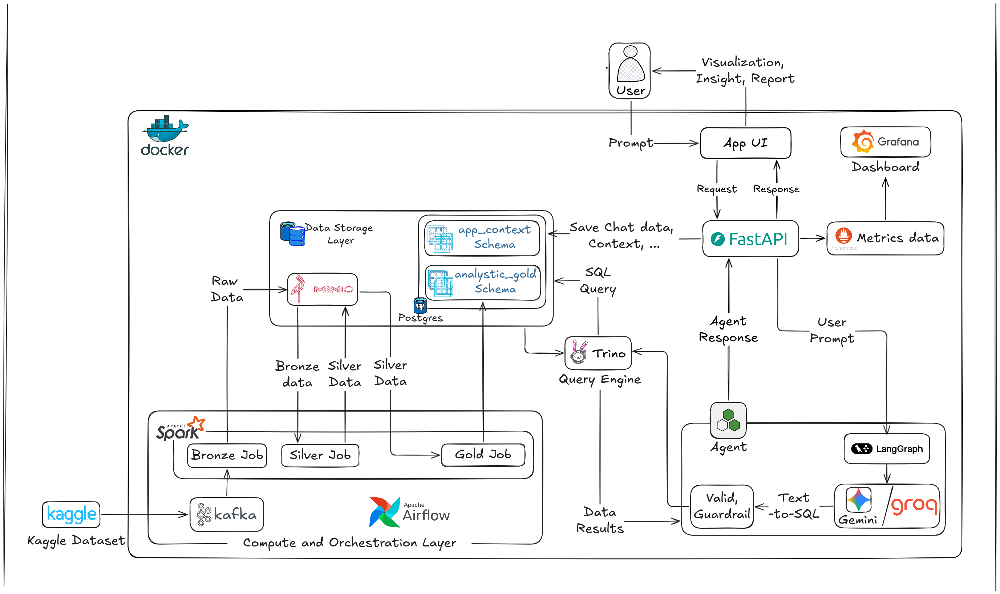
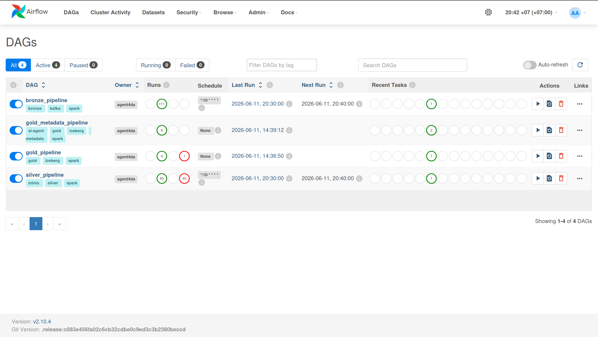
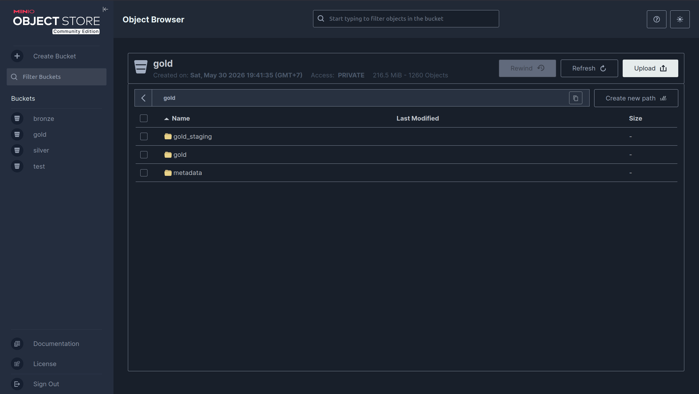
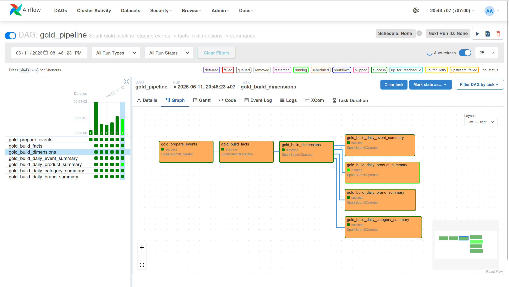
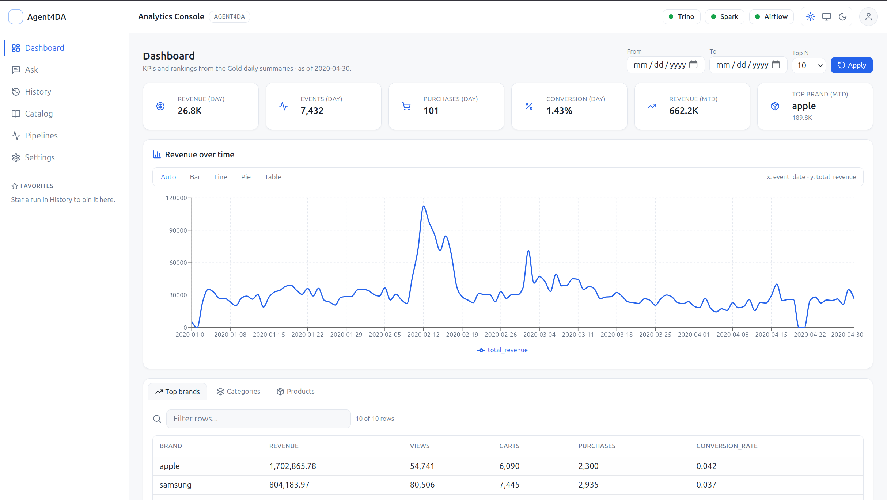
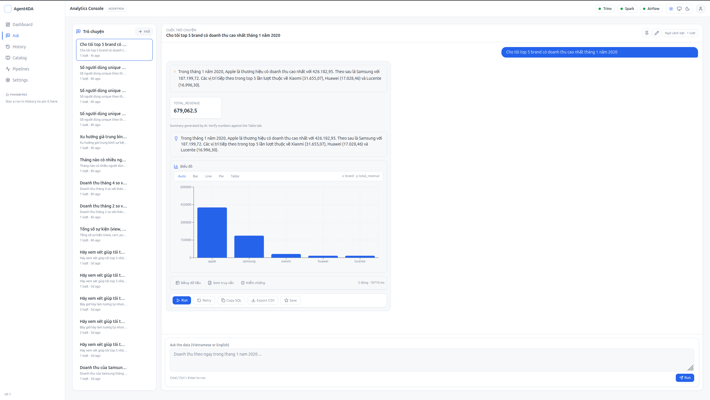
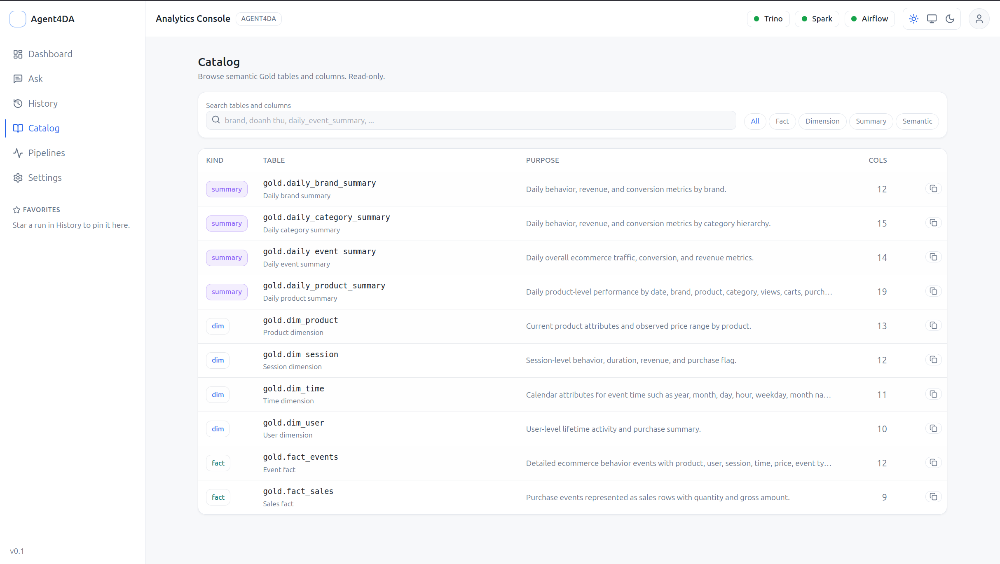
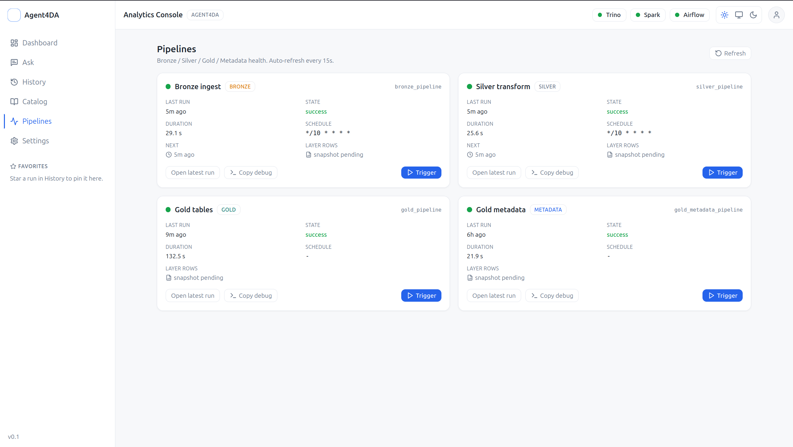
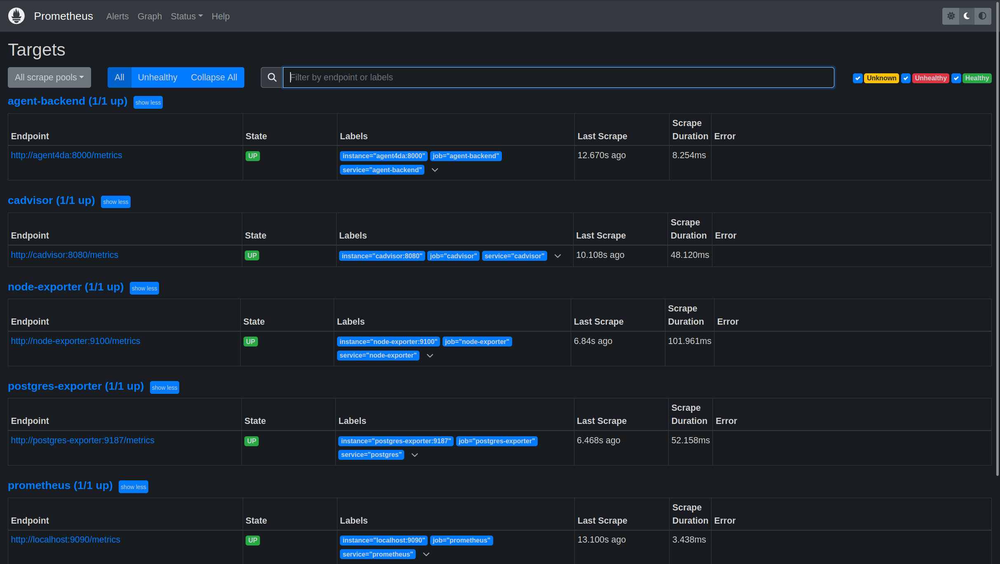
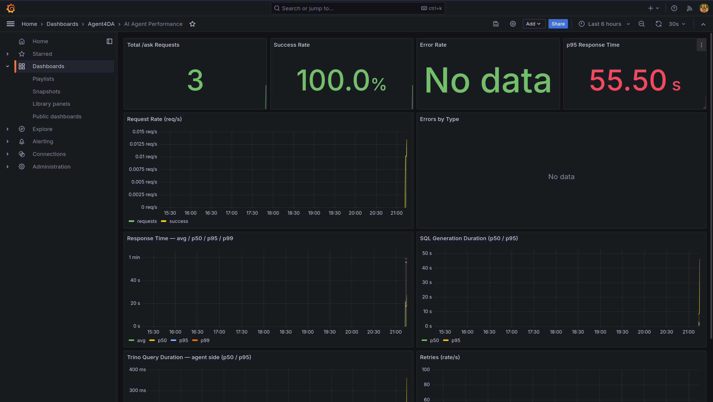

# Agent4DA - Data Engineering & AI Analytics Agent

## 1. Tổng quan dự án

Agent4DA là một hệ thống xử lý dữ liệu và phân tích thông minh cho dữ liệu
e-commerce. Dự án mô phỏng một nền tảng dữ liệu hiện đại theo kiến trúc
Medallion Architecture, gồm các tầng Bronze, Silver và Gold, sau đó sử dụng
Trino và AI Agent để người dùng có thể đặt câu hỏi bằng ngôn ngữ tự nhiên và
nhận lại SQL, bảng kết quả, biểu đồ và phần diễn giải.

Mục tiêu của dự án không chỉ là xây dựng một pipeline ETL, mà là hoàn thiện một
luồng end-to-end:

- Thu thập dữ liệu sự kiện thương mại điện tử từ CSV vào Kafka.
- Xử lý dữ liệu bằng Spark và lưu trên MinIO theo từng tầng dữ liệu.
- Chuẩn hóa dữ liệu, kiểm tra chất lượng và loại bỏ trùng lặp.
- Xây dựng Gold layer bằng Apache Iceberg để phục vụ truy vấn phân tích.
- Truy vấn dữ liệu qua Trino.
- Xây dựng FastAPI backend và Next.js frontend cho dashboard, catalog, lịch sử
  truy vấn và AI Agent.
- Giám sát hệ thống bằng Prometheus và Grafana.

Về tổng thể, Agent4DA là một project lakehouse local có đủ các phần chính của
một hệ thống data platform: ingestion, storage, processing, orchestration,
query engine, semantic metadata, AI analytics application và observability.

## 2. Kiến trúc hệ thống

Luồng dữ liệu tổng quát:

```text
CSV sample data
   -> Kafka topic ecommerce_events
   -> Spark Bronze job
   -> MinIO bronze Parquet
   -> Spark Silver job
   -> MinIO silver Parquet
   -> Spark Gold jobs
   -> Apache Iceberg Gold tables on MinIO
   -> PostgreSQL JDBC catalog metadata
   -> Trino SQL engine
   -> FastAPI + LangGraph AI Agent
   -> Next.js Analytics Console
```

Sơ đồ logic của hệ thống:

```text
+------------------+       +--------------------+
| CSV Producer     | ----> | Kafka KRaft        |
| code/kafka       |       | ecommerce_events   |
+------------------+       +---------+----------+
                                      |
                                      v
+------------------+       +--------------------+       +------------------+
| Airflow DAGs     | ----> | Spark Standalone   | ----> | MinIO Buckets    |
| Orchestration    |       | master + worker    |       | bronze/silver/   |
+------------------+       +---------+----------+       | gold             |
                                      |                  +--------+---------+
                                      v                           |
                            +--------------------+                |
                            | Iceberg Gold       | <--------------+
                            | tables             |
                            +---------+----------+
                                      |
                                      v
                            +--------------------+       +------------------+
                            | PostgreSQL         |       | Trino            |
                            | App DB + Catalog   | <---- | SQL Engine       |
                            +--------------------+       +--------+---------+
                                                                  |
                                                                  v
                                                        +------------------+
                                                        | FastAPI Backend  |
                                                        | LangGraph Agent  |
                                                        +--------+---------+
                                                                 |
                                                                 v
                                                        +------------------+
                                                        | Next.js UI       |
                                                        | Analytics App    |
                                                        +------------------+
```



Hệ thống được tách thành ba nhóm chính:

**Data Platform**

- Kafka tiếp nhận dữ liệu sự kiện.
- Spark xử lý dữ liệu ở các tầng Bronze, Silver, Gold.
- MinIO đóng vai trò object storage tương thích S3.
- Apache Iceberg quản lý Gold tables.
- PostgreSQL lưu Iceberg catalog metadata và dữ liệu ứng dụng.
- Trino phục vụ truy vấn SQL tốc độ cao trên Gold layer.

**Application & AI Agent**

- FastAPI backend cung cấp API cho frontend, auth, history, catalog, metrics và
  tích hợp Agent.
- LangGraph Agent chuyển câu hỏi tự nhiên thành SQL an toàn, truy vấn Trino và
  sinh câu trả lời.
- Next.js frontend cung cấp giao diện Dashboard, Ask, History, Catalog,
  Pipelines và Settings.

**Monitoring & Observability**

- Prometheus scrape metrics từ backend, Trino, PostgreSQL và exporters.
- Grafana hiển thị dashboard hệ thống, pipeline và hiệu năng AI Agent.

## 3. Các công nghệ sử dụng chính

### Data Engineering & Lakehouse

* **Apache Kafka**: Message broker nhận dữ liệu sự kiện e-commerce từ CSV
  producer. Project dùng Kafka KRaft, không cần Zookeeper.
* **Apache Spark**: Engine xử lý dữ liệu phân tán. Spark được dùng cho Bronze,
  Silver và Gold jobs.
* **Apache Airflow**: Điều phối pipeline bằng DAGs. Bronze và Silver chạy định
  kỳ, Gold và Gold Metadata chạy manual khi cần build lại layer phục vụ phân
  tích.
* **MinIO**: Object storage local, tương thích S3. Dữ liệu được lưu theo các
  bucket `bronze`, `silver`, `gold`.
* **Apache Iceberg**: Table format cho Gold layer, giúp dữ liệu Gold có schema,
  metadata và có thể query bằng Trino.
* **PostgreSQL**: Lưu Iceberg JDBC catalog metadata, Airflow metadata và dữ
  liệu ứng dụng như users, sessions, query history.
* **Trino**: Distributed SQL query engine, dùng để truy vấn các bảng Iceberg
  trong Gold layer.

### Backend, Frontend & AI

* **FastAPI**: Backend API cho Analytics Console, authentication, catalog,
  history, settings, pipeline control và Agent execution.
* **LangGraph**: Xây dựng luồng AI Agent gồm guard question, load metadata,
  generate SQL, validate SQL, execute SQL, validate result, plan chart và tạo
  insight.
* **Gemini / Groq**: LLM providers cho Text-to-SQL và diễn giải kết quả. Backend
  hỗ trợ chọn provider/model trong settings.
* **Next.js + React + TailwindCSS**: Frontend application cho người dùng cuối.
* **Recharts**: Hiển thị biểu đồ trong dashboard và kết quả Agent.

### Monitoring

* **Prometheus**: Thu thập metrics HTTP, AI Agent, ETL pipeline, Trino,
  PostgreSQL, host và container.
* **Grafana**: Trực quan hóa metrics bằng các dashboard đã provision sẵn.
* **node-exporter, cAdvisor, postgres-exporter**: Export metrics hệ thống,
  container và PostgreSQL.

## 4. Chức năng chính của hệ thống

### 4.1. Data Pipeline

Pipeline dữ liệu đi qua ba tầng:

**Bronze**

- Đọc message mới từ Kafka topic `ecommerce_events`.
- Parse JSON theo schema e-commerce.
- Thêm Kafka metadata như partition, offset và timestamp.
- Ghi Parquet vào `s3a://bronze/ecommerce_events/`.
- Lưu offset trên MinIO để lần chạy sau không đọc lại dữ liệu cũ.

**Silver**

- Đọc dữ liệu Bronze.
- Chuẩn hóa kiểu dữ liệu timestamp, số, decimal.
- Tách category hierarchy thành `category_l1`, `category_l2`, `category_l3`.
- Validate bản ghi và tách valid/invalid outputs.
- Deduplicate bằng `event_fingerprint`.
- Ghi dữ liệu sạch vào `s3a://silver/ecommerce_events/`.

**Gold**

- Đọc Silver clean events.
- Build staging, fact tables, dimension tables và summary tables.
- Ghi Gold tables bằng Apache Iceberg.
- Các bảng chính gồm:
  - `iceberg.gold.fact_events`
  - `iceberg.gold.fact_sales`
  - `iceberg.gold.dim_time`
  - `iceberg.gold.dim_product`
  - `iceberg.gold.dim_user`
  - `iceberg.gold.dim_session`
  - `iceberg.gold.daily_event_summary`
  - `iceberg.gold.daily_product_summary`
  - `iceberg.gold.daily_category_summary`
  - `iceberg.gold.daily_brand_summary`







### 4.2. Semantic Metadata cho AI Agent

Gold Metadata pipeline tạo hai bảng metadata:

```text
iceberg.metadata.semantic_table_catalog
iceberg.metadata.semantic_column_catalog
```

Hai bảng này mô tả ý nghĩa business của từng bảng và từng cột trong Gold layer,
ví dụ: bảng dùng để trả lời loại câu hỏi nào, grain của bảng là gì, cột nào đại
diện cho doanh thu, lượt xem, conversion rate, brand, product hoặc category.

AI Agent dùng metadata này để hiểu ý nghĩa business của dữ liệu trước khi sinh
SQL. Bộ metadata chuẩn được khai báo trong:

```text
code/spark/gold/metadata_definitions.py
```

### 4.3. AI Analytics Agent

Người dùng có thể đặt câu hỏi như:

```text
Top 10 brand theo doanh thu trong tháng gần nhất
Doanh thu theo ngày trong tháng gần nhất
Danh mục nào có tỷ lệ chuyển đổi cao nhất?
Sản phẩm nào được xem nhiều nhất?
```

Luồng xử lý của Agent:

```text
guard_question
  -> load_metadata
  -> check_answerability
  -> resolve_entities
  -> build_prompt
  -> generate_sql
  -> guard_sql
  -> execute_sql
  -> profile_result
  -> validate_result
  -> plan_chart
  -> generate_insight
  -> build_final_response
```

Các cơ chế an toàn chính:

- Chặn câu hỏi có ý định xóa, sửa, ghi dữ liệu hoặc prompt injection cơ bản.
- Chỉ cho phép SQL dạng `SELECT` hoặc `WITH ... SELECT`.
- Chặn các keyword như `INSERT`, `UPDATE`, `DELETE`, `DROP`, `ALTER`,
  `TRUNCATE`, `CREATE`, `MERGE`, `CALL`, `GRANT`, `REVOKE`.
- Tự thêm `LIMIT` mặc định nếu SQL không có giới hạn.
- Có bước validate result và requery khi kết quả rỗng hoặc thiếu field quan
  trọng.

### 4.4. Analytics Console

Frontend cung cấp các màn hình:

- **Ask**: Chat với AI Agent, xem SQL, bảng dữ liệu, biểu đồ và insight.
- **Dashboard**: KPI tổng quan, doanh thu theo ngày, ranking brand/category/
  product.
- **History**: Lưu lịch sử câu hỏi, trạng thái, thời gian chạy, favorite và
  re-run.
- **Catalog**: Xem semantic metadata của Gold tables và columns.
- **Pipelines**: Theo dõi trạng thái DAG Bronze, Silver, Gold, Metadata và
  trigger pipeline.
- **Settings**: Chọn theme, provider/model, chart mặc định, ngôn ngữ và xem
  trạng thái cấu hình hệ thống.









## 5. Yêu cầu hệ thống

Yêu cầu khuyến nghị để chạy local:

* **Docker** và **Docker Compose**.
* **Make** để dùng các lệnh tiện ích trong `Makefile`.
* **Python 3.10+** cho Kafka producer chạy từ host.
* **RAM 16GB+** được khuyến nghị vì stack gồm Kafka, Spark, Airflow, Trino,
  PostgreSQL, MinIO, backend, frontend và monitoring.
* **CPU 4 cores+** cho stack cơ bản; 8 cores+ giúp chạy mượt hơn.
* **Dung lượng đĩa trống** cho Docker volumes, MinIO data và Spark logs.
* **Kết nối Internet** để pull Docker images và tải dependencies.

Các file runtime cần chuẩn bị:

- `envs/*.env`: biến môi trường và secret local.
- `jars/`: các JAR dependencies cho Spark, Kafka, Hadoop S3A, Iceberg,
  PostgreSQL.
- `data/`: sample CSV để nạp vào Kafka.

Chi tiết biến môi trường xem thêm: [`docs/ENV_SETUP.md`](docs/ENV_SETUP.md).

## 6. Cấu trúc thư mục dự án

```text
agent4da/
├── app/
│   ├── backend/                 # FastAPI backend cho UI và Agent
│   └── frontend/                # Next.js Analytics Console
├── code/
│   ├── agent/                   # LangGraph Agent engine
│   ├── airflow/dags/            # Airflow DAGs
│   ├── kafka/                   # CSV producer và Kafka helper
│   └── spark/                   # Bronze, Silver, Gold Spark jobs
├── docs/                        # Tài liệu chi tiết theo module
├── envs/                        # Local environment files
├── init/                        # PostgreSQL init scripts
├── jars/                        # Spark/Iceberg/Hadoop/Kafka/PostgreSQL jars
├── monitoring/                  # Prometheus, Grafana dashboards, exporters docs
├── notebook/                    # Notebook xem và debug dữ liệu
├── script/                      # Helper scripts cho Spark/Kafka/PostgreSQL
├── trino/                       # Trino config và entrypoint
├── docker-compose.*.yml         # Compose files theo từng service group
├── Makefile                     # Service manager cho local stack
├── README.md                    # Tài liệu tổng quan này
└── PROJECT.md                   # Mô tả ngắn về project
```

## 7. Hướng dẫn cài đặt và triển khai

### 7.1. Thiết lập ban đầu

1. **Chuẩn bị các file môi trường**

   Kiểm tra các file trong `envs/`, đặc biệt:

   - `envs/minio.env`
   - `envs/postgre.env`
   - `envs/airflow.env`
   - `envs/iceberg.env`
   - `envs/spark.env`
   - `envs/app.env`
   - `envs/gemini.env` hoặc `envs/groq.env` cho LLM provider của AI Agent.

   Không hardcode secret vào source code hoặc README. Với môi trường local, thay các
   giá trị `change_me` bằng giá trị phù hợp trên máy chạy.

2. **Chuẩn bị JARs cho Spark**

   Các job Spark dùng JARs trong thư mục `jars/` để đọc Kafka, truy cập MinIO
   qua S3A, ghi Iceberg và kết nối PostgreSQL.

3. **Dùng Makefile làm lối chạy chính**

   Project đã có `Makefile` để gom các lệnh Docker Compose dài thành các lệnh
   ngắn, thống nhất và ít nhầm service/port hơn. Khi chạy bằng `make`, network
   `data_network` được tạo tự động.

   | Lệnh | Mục đích |
   | --- | --- |
   | `make all-build` | Build các image local cần thiết |
   | `make all-up` | Khởi động toàn bộ stack |
   | `make ps` | Xem trạng thái containers |
   | `make all-down` | Dừng toàn bộ stack |
   | `make agent-build && make agent-up` | Build và chạy riêng backend |
   | `make frontend-build && make frontend-up` | Build và chạy riêng frontend |
   | `make monitoring-up` | Chạy riêng Prometheus/Grafana stack |

### 7.2. Build và khởi động hệ thống

1. **Build các image local**

   ```bash
   make all-build
   ```

   Có thể build riêng từng nhóm:

   ```bash
   make airflow-build
   make agent-build
   make frontend-build
   ```

2. **Khởi động toàn bộ stack**

   ```bash
   make all-up
   ```

   Lệnh này khởi động Kafka, MinIO, Spark, Airflow, Trino, backend, frontend và
   monitoring. `make all-up` dùng image đã build sẵn, nên quy trình chuẩn là
   build trước rồi start stack.

3. **Kiểm tra trạng thái containers**

   ```bash
   make ps
   ```

4. **Dừng toàn bộ stack**

   ```bash
   make all-down
   ```

### 7.3. Nạp dữ liệu vào Kafka

Sau khi Kafka đã chạy, gửi sample CSV vào topic `ecommerce_events`:

```bash
python code/kafka/producer.py \
  --file data/event_test_1000.csv \
  --broker localhost:9092 \
  --topic ecommerce_events
```

Producer đọc từng dòng CSV, chuyển thành JSON và gửi vào Kafka.

### 7.4. Chạy pipeline dữ liệu

Pipeline dữ liệu được điều phối bằng Airflow. Bronze và Silver có lịch chạy mỗi
10 phút; Gold và Gold Metadata được trigger khi cần build lại layer phân tích.

Cách chạy trực tiếp trên Airflow UI:

1. Mở Airflow tại `http://localhost:8081`.
2. Vào danh sách DAGs.
3. Trigger lần lượt các DAG:
   - `bronze_pipeline`
   - `silver_pipeline`
   - `gold_pipeline`
   - `gold_metadata_pipeline`

Cách chạy nhanh bằng CLI trong container Airflow:

```bash
docker exec airflow airflow dags trigger bronze_pipeline
docker exec airflow airflow dags trigger silver_pipeline
docker exec airflow airflow dags trigger gold_pipeline
docker exec airflow airflow dags trigger gold_metadata_pipeline
```

Thứ tự chạy end-to-end:

1. Gửi CSV vào Kafka.
2. Trigger `bronze_pipeline`.
3. Trigger `silver_pipeline`.
4. Trigger `gold_pipeline`.
5. Trigger `gold_metadata_pipeline`.
6. Mở Trino hoặc frontend để kiểm tra Gold data.

Query mẫu trong Trino:

```sql
SELECT *
FROM iceberg.gold.daily_event_summary
LIMIT 10;
```

```sql
SELECT table_name, display_name, grain
FROM iceberg.metadata.semantic_table_catalog
ORDER BY table_name;
```

### 7.5. Sử dụng Analytics Console

1. Mở frontend:

   ```text
   http://localhost:3000
   ```

2. Đăng nhập bằng admin được seed từ `envs/app.env`:

   ```text
   APP_BOOTSTRAP_ADMIN_EMAIL
   APP_BOOTSTRAP_ADMIN_PASSWORD
   ```

3. Vào các màn hình chính:

   - **Dashboard** để xem KPI và ranking.
   - **Ask** để hỏi AI Agent.
   - **History** để xem lại các lần hỏi.
   - **Catalog** để kiểm tra semantic metadata.
   - **Pipelines** để xem và trigger DAGs.
   - **Settings** để chọn provider/model và kiểm tra cấu hình.

### 7.6. Giám sát bằng Prometheus và Grafana

Monitoring được chạy cùng `make all-up`. Có thể chạy riêng bằng:

```bash
make monitoring-up
```

Các UI monitoring:

- Prometheus: `http://localhost:19090`
- Grafana: `http://localhost:13000`

Grafana có các dashboard:

- System Overview
- AI Agent Performance
- ETL Pipeline Monitoring
- Query / Data Layer

Backend expose Prometheus metrics tại:

```text
http://localhost:8083/metrics
```





## 8. Các URLs quan trọng

| Dịch vụ | URL | Mô tả |
| --- | --- | --- |
| Frontend Analytics Console | `http://localhost:3000` | Giao diện chính cho người dùng |
| Backend Swagger UI | `http://localhost:8083/docs` | Tài liệu API tương tác |
| Backend Metrics | `http://localhost:8083/metrics` | Prometheus scrape endpoint |
| Airflow UI | `http://localhost:8081` | Quản lý DAGs và task logs |
| MinIO Console | `http://localhost:9001` | Xem buckets `bronze`, `silver`, `gold` |
| MinIO S3 API | `http://localhost:9000` | Endpoint S3-compatible |
| Spark Master UI | `http://localhost:8080` | Theo dõi Spark cluster |
| Trino | `http://localhost:8082` | SQL query engine |
| Kafka external bootstrap | `localhost:9092` | Producer chạy từ host |
| PostgreSQL | `localhost:5432` | Shared DB cho catalog/app/Airflow |
| Prometheus | `http://localhost:19090` | Metrics và targets |
| Grafana | `http://localhost:13000` | Dashboards |

## 9. Checklist kiểm thử end-to-end

Checklist dưới đây giúp kiểm tra nhanh toàn bộ hệ thống từ ingestion đến UI và
monitoring:

1. **Kiểm tra kiến trúc**

   Đối chiếu các service chính: Kafka, Spark, MinIO, Iceberg, PostgreSQL, Trino,
   FastAPI, Next.js và monitoring.

2. **Kiểm tra Airflow DAGs**

   Mở Airflow tại `http://localhost:8081`, kiểm tra các DAG:

   - `bronze_pipeline`
   - `silver_pipeline`
   - `gold_pipeline`
   - `gold_metadata_pipeline`

3. **Kiểm tra dữ liệu trên MinIO**

   Mở MinIO tại `http://localhost:9001`, kiểm tra buckets:

   - `bronze`
   - `silver`
   - `gold`

4. **Query Gold data bằng Trino**

   Chạy query trên `iceberg.gold.daily_event_summary` hoặc
   `iceberg.metadata.semantic_table_catalog` để chứng minh Gold layer đã query
   được bằng SQL.

5. **Kiểm tra Analytics Console**

   Truy cập `http://localhost:3000`, vào Dashboard để xem KPI và Ask để hỏi AI
   Agent. Câu hỏi kiểm thử gợi ý:

   ```text
   Top 10 brand theo doanh thu trong tháng gần nhất
   ```

6. **Kiểm tra guardrail của Agent**

   Kiểm tra Agent không cho phép SQL ghi/xóa/sửa dữ liệu, chỉ sinh truy vấn đọc,
   có semantic metadata và có bước validate result.

7. **Kiểm tra monitoring**

   Mở Grafana tại `http://localhost:13000`, xem dashboard AI Agent Performance
   hoặc ETL Pipeline Monitoring để chứng minh hệ thống có observability.

## 10. Tài liệu chi tiết

Các tài liệu sâu hơn nằm trong thư mục `docs/`:

- [`docs/README.md`](docs/README.md): tài liệu tổng quan kỹ thuật chi tiết hơn.
- [`docs/ENV_SETUP.md`](docs/ENV_SETUP.md): các biến môi trường cần chuẩn bị.
- [`docs/AGENT_API.md`](docs/AGENT_API.md): API liên quan Agent.
- [`docs/AGENT_DEBUG.md`](docs/AGENT_DEBUG.md): hướng dẫn debug Agent.
- [`docs/TRINO_ENV.md`](docs/TRINO_ENV.md): cấu hình Trino.
- [`docs/GOLD_METADATA_PIPELINE.md`](docs/GOLD_METADATA_PIPELINE.md): metadata
  pipeline cho Agent.
- [`monitoring/README.md`](monitoring/README.md): module Prometheus/Grafana.

## 11. Cấu hình triển khai

- `make all-up` là lệnh khởi động chuẩn cho toàn bộ project, bao gồm cả
  PostgreSQL shared instance trong `docker-compose.airflow.yml`.
- Kafka producer chạy từ host sử dụng bootstrap server `localhost:9092`.
- Trino query Gold layer qua Iceberg catalog ở chế độ đọc an toàn.
- AI Agent sử dụng Gemini hoặc Groq thông qua các biến môi trường trong
  `envs/gemini.env` hoặc `envs/groq.env`.
- Frontend gọi backend qua `NEXT_PUBLIC_API_BASE_URL`; backend kiểm soát CORS
  bằng `APP_CORS_ORIGINS`.

---

*Tài liệu này được cập nhật lần cuối vào: 11/06/2026.*
